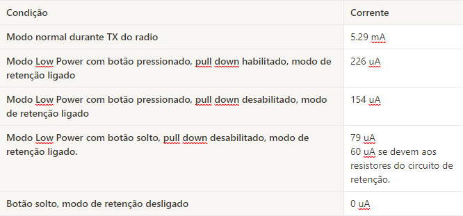
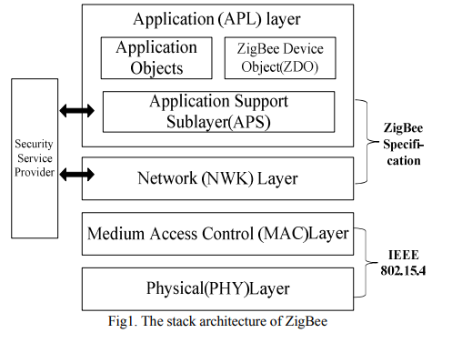

# TCC

### [Link Overleaf](https://pt.overleaf.com/project/63dbd9dfc1673d779766c71e)

Características do dispositivo usado:
* MCU: STM32G070CBT6 or STM32G070RBT6 Arm® Cortex®-M0+ 32-bit MCU, 128 KB Flash, 36 KB RAM
* Interface de comunicação: modulo de rádio Si24R1 2.4GHz - usa interface SPI com o MCU
* Alimentação: pilha CR2032

Consumo de energia do controle:

---
---

## Conteúdos Relacionados
### ZigBee
  O ZigBee é um padrão de comunição baseado em *Wireless Local Area Networks* (WLAN) baseado no protocolo IEEE 802.15.4, dentro da rede são definidos três tipos de nós: Coordenador, Roteador e Dispostivos de Borda. Ele é amplamente usado em aplicações de IoT por conta de seu baixo custo e complexidade além de ser bastante estável. Sua arquitetura utiliza a camada MAC e a camada física definidas pelo protocolo da IEEE enquanto as camadas de rede e de aplicação são próprias do ZigBee. 
  
  Para garantir a segurança de suas camadas o ZigBee utiliza algoritmo de criptografia simétrica AES-128. Esse algortimo faz operações em matrizes 4 x 4 com blocos de 128 bits durante 10 rodadas e dentro do ZigBee é responsável por criptografar os pacotes de entrada e criar textos de saída cifrados.

  Além disso, o protocolo conta com três tipos de chave: mestre, de rede e de enlace. As chave mestre são utlizadas para garantir a que a troca de chaves de Enlace permaneça confidencial, vem configurada de fábrica e geralmente é compartilhada entre todos os nós. A chave de enlace é usada para criptografar a troca de informação entre dois nós, é unica para cada par de nós e é gerenciada pela camada de aplicação. Já a chave de rede é utilizada para acrescentar novos nós na rede e é criada por um módulo chamado Trust Center.

  

  O protocolo ZigBee apresenta algumas fragilidades em sua segurança dependendo do nível de segurança selecionado. Entre elas está a distribuição das chaves, como todos os nós têm a chave mestre se um deles for comprometido toda a comunicação da rede não pode ser mais confiada. Outro problema de segurança está no algoritmo de criptografia utilizado, antes de iniciar a comunicação entre duas partes é preciso que elas compartilhem a chave para criptografar a conversa, com isso, um terceiro malicioso pode ter acesso a essa chave também.

  Além disso o ZigBee não garante a integridade do esquema de segurança, dependendo apenas do CRC para checar os dados de um quadro, e com isso, as mensagens podem ser facilmente adulteradas.

  Refs:
  - [Sun et al.; 2011](artigos/sun2011.pdf)
  - [Razouk et al.; 2014](artigos/razouk2014.pdf)
  - [Yang, Bin; 2009](artigos/yang2009.pdf)
  - [ZigBee Especifications](docs/zigbee_especification.pdf)

---

### Bluetooth Low Energy - BLE
  O Bluetooth Low Energy é mais um dos protocolos de comunicação utilizados por dispositivos IoT com limitações de energia e de memória. De maneira diferente ao ZigBee o BLE usa uma *Wireless Personal Area Network* (WPAN) para a conexão dos dispositivos. Além disso, o BLE conta com algumas vantagens quando comparado ao ZigBee, entre elas está o suporte em todos sistemas operacionais modernos e o menor consumo de energia que ele apresenta.

  Para estabelecer uma conexão segura entre dois dispositivos BLE é preciso que os dois concordem em uma chave temporária (Tempeorary Key - TK) que, junto de alguns números aleatórios, será utilizada para gerar uma chave de curta duração (Short Term Key - STK). Essa STK é utilizada para autenticar os dispositivos e para distribuir a chave de longa duração (Long Term Key - LTK), gerada com criptografia de curvas elípticas. Cada dispositivo gera a mesma chave AES-128, criada a partir da chave ECC pública do outro dispositivo e da sua chave ECC privada.

  Entre alguns dos problemas de segurança do Bluetooth Low Energy está no fato da chave TK ser pequena, e pode ser facilmente encontrada com um ataque de força bruta, e se a chave TK pode ser encontrada a chave STK pode ser calculada. Assim, toda a comunicação entre os dois dispositivos pode ser descriptografada.

  Outros problemas de segurança aparecem por conta do algoritmo de cifra utilizado, assim como no ZigBee o BLE utiliza criptografia síncrona que permite diversos tipos de ataque como *Sniffing* passivo e *Man-In-The-Middle*. Estes tipos de ataque são facilmente reproduzidos com software livre encontrado na internet e não necessitam de hardware adicional

  Refs:
  - [IoT Security Using BLE Encryption](https://www.networkcomputing.com/wireless-infrastructure/iot-security-using-ble-encryption)
  - [Deep Dive into Bluetooth LE Security](https://medium.com/rtone-iot-security/deep-dive-into-bluetooth-le-security-d2301d640bfc#:~:text=The%20encryption%20in%20Bluetooth%20LE,Signature%20Resolving%20Key%20(CSRK).)
  - [IEEE](https://ieeexplore.ieee.org/stamp/stamp.jsp?arnumber=9706334)
  

---

---
## Reunião 28/03/2023

### Pontos Discutidos

* Definido rumo do trabalho: Implementar comunicação segura entre Keyfob e Moto
* Sugestões de pesquisa: IoT Low Consumption IEEE, Bluetooth Lowpower, Zigbee
* Pesquisar os protocolos que essas soluções utilizam para manter sua comunicação segura
* Escrever ~4 parágrafos para cada uma, 2-3 explicando a solução empregada e 2 fazendo uma crítica a ela
* Texto pode ser usado como Estudos Relacionados

### Data de Entrega

- [ ] 04/04/2023

### Pesquisas

* IEEE Low Consumption
* Bluetooth Low Energy - BLE
* 6LoWPAN
* ZigBee

---